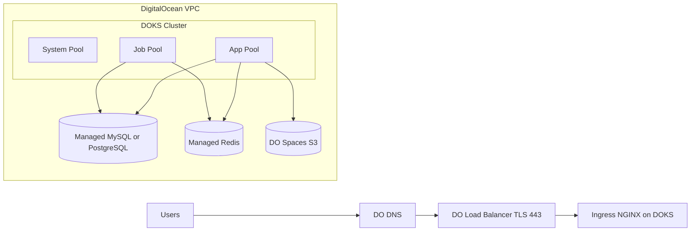
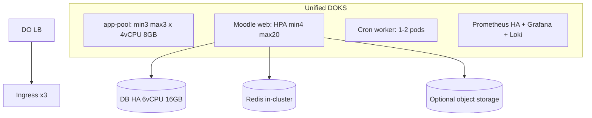

# Moodle K8s Infrastructure

Cloud-agnostic Kubernetes infrastructure for deploying [HCMUT Moodle LMS](https://github.com/nguyendangcuong201004/moodle-k8s-project) on any cloud provider.

## Architecture

```
Per-Cloud (Terraform)              Cloud-Agnostic (Helm)
┌─────────────────┐               ┌──────────────────────┐
│ digitalocean/   │──┐            │  helm/moodle/        │
│   terraform     │  │            │    values.yaml       │
│   setup.sh      │  │  helm      │    templates/        │
│   (Longhorn)    │──┼──install──>│      deployment      │
│                 │  │            │      service, hpa    │
│ aws/            │  │            │    templates/        │
│   terraform     │──┘            │      deployment      │
│   setup.sh      │               │      service, hpa    │
│   (EFS CSI)     │               │      pvc, secret     │
└─────────────────┘               │      ingress         │
                                  └──────────────────────┘
```

- **Terraform** handles cloud-specific resources (cluster, database, networking).
- **Helm chart** deploys Moodle identically on any K8s cluster.
- **setup.sh / destroy.sh** per cloud orchestrate the full lifecycle.

## DigitalOcean Unified High-Capacity Architecture

### Shared Infrastructure Blueprint





### Capacity Defaults

| Component | Unified Default |
|---|---|
| DOKS app-pool | min 3, max 3 (`4vCPU/8GB`) |
| Moodle web pods | HPA min 4, max 20 |
| Web pod requests/limits | `1 CPU/2 CPU`, `2Gi/4Gi` |
| Cron requests/limits | `300m/1 CPU`, `512Mi/1Gi` |
| DB managed | HA `6vCPU/16GB` |
| PVC | `80Gi` |

Quota note: default node autoscale is intentionally set to `min=3, max=3` to avoid DigitalOcean 422 droplet-limit failures on new accounts. After your droplet quota is increased, scale by exporting Terraform vars before deploy:

```bash
export TF_VAR_node_pool_min_nodes=3
export TF_VAR_node_pool_max_nodes=6
./setup.sh production
```

### Kubernetes Policy and Reliability Defaults

- Web `Deployment`: `maxUnavailable=0`, `maxSurge=1`.
- PodDisruptionBudget: tune based on SLO and maintenance windows.
- Anti-affinity required for web and ingress pods.
- HPA target: CPU 60%, memory 75%.
- Cluster Autoscaler enabled for all node pools.
- Backup policy: DB daily snapshot + weekly restore test.

## Supported Clouds

| | DigitalOcean | AWS |
|---|---|---|
| Kubernetes | DOKS (managed) | EKS (managed) |
| Database | Managed PostgreSQL | RDS PostgreSQL |
| Storage (RWX) | Longhorn | EFS + CSI driver |
| Load Balancer | DO LB | NLB / Ingress Nginx |
| Networking | Managed VPC | Self-managed VPC |

## Unified Auto-Scaling Profile

The Helm chart now uses one production-first profile in `values.yaml`:

| Setting | Value |
|---|---|
| HPA | enabled |
| Replicas | min 4, max 20 |
| CPU / Memory target | 60% / 75% |
| Scale up behavior | +4 pods / 60s, 15s stabilization |
| Scale down behavior | -1 pod / 120s, 420s stabilization |

## Prerequisites

- [Terraform](https://www.terraform.io/) >= 1.9
- [kubectl](https://kubernetes.io/docs/tasks/tools/)
- [Helm](https://helm.sh/docs/intro/install/) >= 3
- [jq](https://jqlang.github.io/jq/)
- Cloud-specific: `DO_TOKEN` for DigitalOcean, AWS CLI configured for AWS

## Quick Start

### 1. Configure environment

Create a `.env` file in the project root:

```bash
# Moodle admin
MOODLE_ADMIN_USER=admin
MOODLE_ADMIN_PASS=your_admin_password
MOODLE_ADMIN_EMAIL=admin@example.com

# Site URLs
MOODLE_WWWROOT=https://lms.yourdomain.com
MOODLE_STAGING_WWWROOT=https://staging-lms.yourdomain.com

# DigitalOcean
DO_TOKEN=your_digitalocean_api_token

# AWS (optional)
AWS_PROFILE=devops
AWS_REGION=ap-southeast-1

# Optional: Cloudflare DNS automation
# CF_API_TOKEN=your_cloudflare_token
```

### 2. Deploy

**DigitalOcean:**
```bash
cd digitalocean
./setup.sh staging      # or: ./setup.sh production
```

**AWS:**
```bash
cd aws
./setup.sh
```

### 3. Destroy

```bash
cd digitalocean
./destroy.sh staging    # or: ./destroy.sh production
```

## DigitalOcean Setup Flow

| Step | Action |
|---|---|
| 0 | Validate tools and environment variables |
| 1 | Terraform apply — create DOKS cluster + Managed PostgreSQL |
| 1.5 | Install Longhorn (RWX storage) |
| 1.6 | Install metrics-server (required for HPA) |
| 2 | Deploy Moodle via Helm chart |
| 3 | GRANT schema permissions to DB user (K8s Job) |
| 4 | Wait for Moodle pod to reach Running phase |
| 5 | Set moodledata permissions + install Moodle database |

## AWS Setup Flow

| Step | Action |
|---|---|
| 0 | Validate tools and AWS profile |
| 1 | Terraform apply — create VPC, EKS, RDS, EFS |
| 2 | Configure kubectl for EKS |
| 3 | Install EFS CSI driver addon |
| 4 | Install Nginx Ingress Controller |
| 5 | Scale CoreDNS to 1 replica |
| 6 | Deploy Moodle via Helm (production + staging) |
| 7 | Create staging database |
| 8 | Install Moodle database for production |
| 9 | Setup staging environment |

## Helm Chart

The chart at `helm/moodle/` is cloud-agnostic. Cloud-specific values are passed via `--set` flags in setup.sh.

```bash
# Lint
helm lint helm/moodle/

# Dry-run render
helm template moodle helm/moodle/ \
    -f helm/moodle/values.yaml \
  --set db.host=mydb.example.com \
  --set db.password=secret \
  --set moodle.wwwroot=https://lms.example.com

# Manual upgrade (e.g., change image tag)
helm upgrade moodle helm/moodle/ -n moodle --set image.tag=v2.0
```

### Key Helm Values

| Value | Description | Default |
|---|---|---|
| `image.repository` | Moodle Docker image | `ndcuongdevops/moodle-lms` |
| `image.tag` | Image tag | `staging` |
| `db.host` | PostgreSQL host | (required) |
| `db.password` | PostgreSQL password | (required) |
| `moodle.wwwroot` | Site URL | (required) |
| `persistence.storageClass` | Storage class | `""` (longhorn for DO, efs-sc for AWS) |
| `service.type` | Service type | `ClusterIP` (LoadBalancer for DO) |
| `autoscaling.enabled` | Enable HPA | `true` |

## CI/CD

GitHub Actions workflow (`.github/workflows/validate.yml`) runs on push and PR:

| Job | What it checks |
|---|---|
| **Terraform Validate** | `fmt -check` + `init` + `validate` for DO and AWS |
| **Terraform Plan** | `terraform plan` on PRs (requires `DO_TOKEN` secret) |
| **Security Scan** | tfsec (Terraform) + kubesec (Helm Deployment) |
| **Helm Validate** | Lint + template render for unified profile |
| **ShellCheck** | Shell script syntax checking |

### GitHub Secrets

| Secret | Required for |
|---|---|
| `DO_TOKEN` | Terraform Plan job on PRs |

## Stress Testing

Built-in capacity testing with [k6](https://k6.io/):

```bash
cd stress-test

# Install k6
sudo snap install k6

# Run stress test
BASE_URL="https://lms.yourdomain.com" k6 run --vus 50 --duration 3m k6-moodle.js

# Watch HPA scaling (separate terminal)
watch -n 5 'kubectl get hpa -n moodle && echo "---" && kubectl get pods -n moodle'
```

| VUs | Simulated Users | Recommended Setup |
|---|---|---|
| 50 | ~500 - 1,000 | Unified defaults |
| 150 | ~1,500 - 3,000 | Unified defaults |
| 300 | ~3,000 - 6,000 | Unified defaults + monitor HPA/node autoscale |

## Project Structure

```
moodle-k8s-infra/
├── .github/workflows/     # CI/CD pipeline
│   └── validate.yml
├── helm/moodle/           # Cloud-agnostic Helm chart
│   ├── Chart.yaml
│   ├── values.yaml        # Unified high-capacity defaults
│   └── templates/
├── digitalocean/          # DO-specific Terraform + scripts
│   ├── *.tf
│   ├── setup.sh
│   ├── destroy.sh
│   └── k8s/external-dns-cloudflare.yaml
├── aws/                   # AWS-specific Terraform + scripts
│   ├── *.tf
│   ├── setup.sh
│   ├── destroy.sh
│   └── k8s/ingress-nginx/values.yaml
├── stress-test/           # k6 capacity testing
└── docs/
```

## Cost Optimization

Designed for a **setup-demo-destroy** workflow using cloud free credits:

| Cloud | Free Credit | Cost per 3-hour demo |
|---|---|---|
| DigitalOcean | $200 / 60 days | ~$0.54 |
| GCP | $300 / 90 days | ~$0.50 |
| Azure | $200 / 30 days | ~$0.50 |

DigitalOcean with $200 credit supports **~370 demo sessions**.
