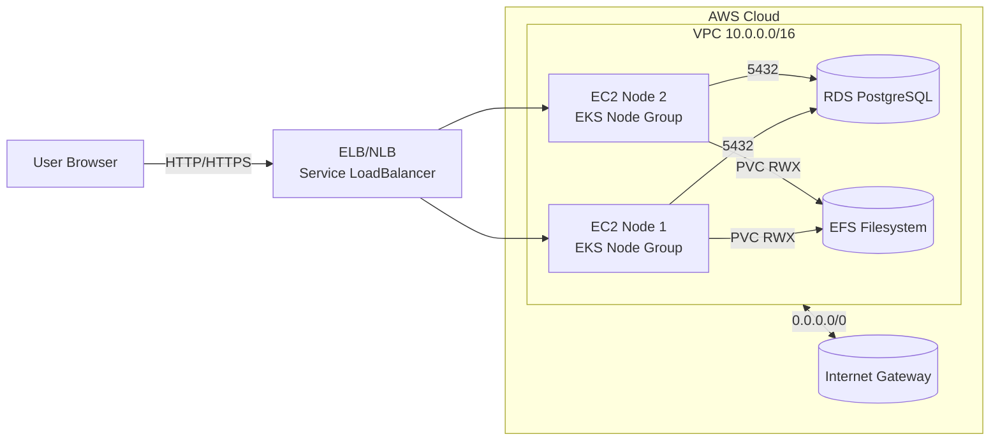
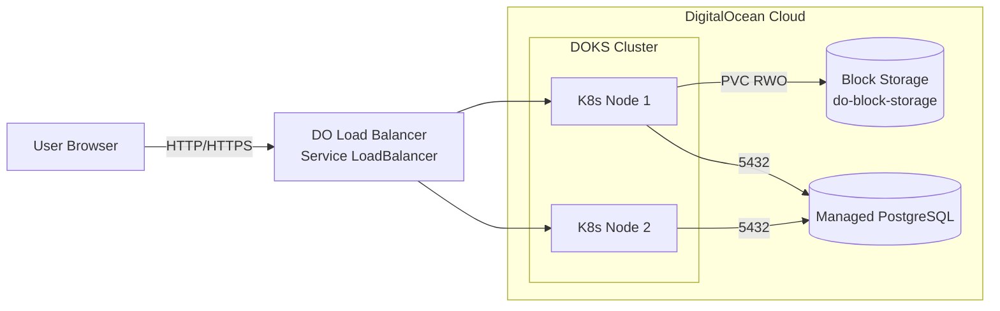

# Moodle IaC – So sánh kiến trúc AWS vs DigitalOcean (Kubernetes)

Repository này chứa hai bộ IaC để triển khai Moodle trên Kubernetes:

- Thư mục `aws/`: EKS + RDS + EFS trên AWS.
- Thư mục `digitalocean/`: DOKS (DigitalOcean Kubernetes) + Managed Database + Block Storage.

Tài liệu này giúp bạn hiểu **kiến trúc** của từng bên và **sự khác biệt chính**.

---

## 1. Kiến trúc AWS (EKS + RDS + EFS)

### Thành phần chính

- **Networking**
  - `aws_vpc.moodle_vpc` – VPC riêng CIDR `10.0.0.0/16`.
  - 2 **Public Subnet**:
    - `10.0.1.0/24` (AZ `ap-southeast-1a`)
    - `10.0.2.0/24` (AZ `ap-southeast-1b`)
  - `aws_internet_gateway.igw` + `aws_route_table.public_rt` route `0.0.0.0/0` ra Internet.
  - Tag subnet cho EKS Load Balancer: `kubernetes.io/role/elb = 1`.

- **Kubernetes Cluster (EKS)**
  - `aws_eks_cluster.moodle_cluster` – control plane managed.
  - `aws_eks_node_group.moodle_nodes` – node group EC2:
    - Loại máy: `t3.micro`, autoscaling (min 1, desired 2, max 3).
  - IAM:
    - `aws_iam_role.eks_cluster_role` + policy `AmazonEKSClusterPolicy`.
    - `aws_iam_role.eks_node_role` + các policy cho:
      - EKS worker nodes.
      - CNI.
      - ECR read-only.
    - `aws_iam_role.efs_csi_role` + policy `AmazonEFSCSIDriverPolicy` (OIDC).

- **Database (RDS)**
  - `aws_db_instance.moodle_db` – PostgreSQL:
    - Engine: `postgres` 16.6, instance `db.t3.micro`, 20 GB gp2.
    - DB name `moodle`, user `moodleuser`, password hard-code trong Terraform.
  - `aws_db_subnet_group.moodle_db_subnet_group` – sử dụng 2 public subnet.
  - `aws_security_group.rds_sg` – mở cổng 5432 cho CIDR `10.0.0.0/16`.
  - Output: `rds_endpoint`.

- **Storage chia sẻ (EFS)**
  - `aws_efs_file_system.moodle_efs` – encrypted.
  - `aws_efs_mount_target.mt_1`, `mt_2` – mount vào 2 public subnet.
  - `aws_security_group.efs_sg` – mở cổng NFS 2049 cho `10.0.0.0/16`.
  - Output: `efs_id`.

- **Kubernetes Manifests (aws/k8s-moodle.yaml)**
  - `PersistentVolume` sử dụng CSI driver `efs.csi.aws.com`, `volumeHandle` = ID EFS.
  - `PersistentVolumeClaim` RWX (`ReadWriteMany`) gắn với EFS.
  - `Deployment` Moodle:
    - Image: `ndcuongdevops/moodle-lms:v1.0.6`.
    - Mount `/var/www/moodledata` từ PVC.
    - Env DB:
      - `MOODLE_DB_HOST` = endpoint RDS (hard-code).
      - `MOODLE_DB_USER`, `MOODLE_DB_PASSWORD` hard-code.
  - `Service` type `LoadBalancer` (ELB/NLB AWS).

### Sơ đồ kiến trúc AWS (mô tả)

Đặc trưng:

- Kiểm soát chi tiết VPC, subnet, route, security group.
- EKS sử dụng EC2 node group với IAM phức tạp.
- EFS cung cấp **ReadWriteMany** cho Moodle data, phù hợp nhiều replica.
- DB & mật khẩu đang hard-code trong IaC/K8s.

---

## 2. Kiến trúc DigitalOcean (DOKS + Managed DB + Block Storage)

### Thành phần chính

- **Provider & Region**
  - `digitalocean` provider với:
    - Biến `do_token` (API token – sensitive).
    - Biến `region` (mặc định `sgp1` – Singapore).

- **Kubernetes Cluster (DOKS)**
  - `digitalocean_kubernetes_cluster.moodle_cluster`:
    - Region: `sgp1`.
    - Version: `1.30.1-do.0` (có thể đổi theo version mới nhất).
    - `node_pool`:
      - name `moodle-node-pool`.
      - size `s-2vcpu-4gb`.
      - `node_count = 2`.
  - Output: `kubeconfig` (raw) để cấu hình `kubectl`/CI.
  - VPC & networking do DigitalOcean tự quản lý (không khai báo VPC/subnet/route thủ công).

- **Database (Managed Database)**
  - `digitalocean_database_cluster.moodle_db`:
    - Engine `pg`.
    - Version `16`.
    - Size `db-s-1vcpu-1gb`.
    - Node count 1.
  - `digitalocean_database_db.moodle` – DB `moodle`.
  - `digitalocean_database_user.moodle`:
    - Username `moodleuser`.
    - Password từ biến `db_password` (Terraform variable, sensitive).
  - Outputs:
    - `db_host` – private hostname.
    - `db_port`.
    - `db_name`.
    - `db_user`.

- **Storage cho Moodle (Block Storage qua CSI)**
  - Sử dụng **DigitalOcean Block Storage** thông qua CSI driver mặc định trên DOKS:
    - StorageClass: `do-block-storage`.
  - `PersistentVolumeClaim` `moodle-data-pvc`:
    - `accessModes: ReadWriteOnce`.
    - `storage: 50Gi`.

- **Kubernetes Manifests (digitalocean/k8s-moodle.yaml)**
  - `PVC` `moodle-data-pvc` dùng `do-block-storage`.
  - `Deployment` Moodle:
    - Image: `ndcuongdevops/moodle-lms:v1.0.6`.
    - Mount `/var/www/moodledata` từ PVC.
    - Env DB (placeholder):
      - `MOODLE_DB_HOST = "REPLACE_WITH_DO_DB_HOST"` (nên lấy từ output `db_host`).
      - `MOODLE_DB_PASSWORD = "REPLACE_WITH_DB_PASSWORD"` (nên đồng bộ với `db_password` và dùng Secret).
  - `Service` type `LoadBalancer` (DigitalOcean Load Balancer).

### Sơ đồ kiến trúc DigitalOcean (mô tả)

Đặc trưng:

- DOKS & networking managed, ít resource Terraform hơn.
- Database là Managed PostgreSQL với DB & user riêng, password qua biến Terraform (không hard-code trong code).
- Storage dùng Block Storage:
  - Đơn giản, tự động qua StorageClass `do-block-storage`.
  - **ReadWriteOnce** – phù hợp 1 replica hoặc kiến trúc không cần share đọc/ghi từ nhiều node cùng lúc.

---

## 3. So sánh khác biệt chính

- **Mạng & VPC**
  - **AWS**: tự định nghĩa VPC, subnet, route, security group → linh hoạt, chi tiết hơn nhưng phức tạp.
  - **DigitalOcean**: dùng VPC & networking managed của DOKS → đơn giản, ít Terraform hơn, đổi lại ít tùy biến mạng low-level.

- **Cluster Kubernetes**
  - **AWS (EKS)**: cần cấu hình IAM roles/policies, node group EC2, OIDC… → mạnh nhưng phức tạp.
  - **DigitalOcean (DOKS)**: chỉ cần khai báo cluster + node pool → dễ dùng hơn, ít khái niệm cloud-specific.

- **Database**
  - **AWS (RDS)**:
    - DB nằm trong VPC riêng, security group quyết định quyền truy cập.
    - Endpoint & password đang hard-code trong IaC/K8s.
  - **DigitalOcean (Managed DB)**:
    - Host & user/password được output từ Terraform, dễ tích hợp với secret hơn.
    - Mật khẩu đã tách ra thành Terraform variable (`db_password` – sensitive).

- **Storage cho Moodle data**
  - **AWS**:
    - Dùng **EFS** + CSI driver → `ReadWriteMany`, rất phù hợp multi-replica Moodle và chia sẻ file giữa node.
  - **DigitalOcean**:
    - Dùng **Block Storage** với StorageClass `do-block-storage` → `ReadWriteOnce`.
    - Đủ cho 1 replica hoặc workload ít yêu cầu share RWX; nếu cần giống EFS, phải bổ sung giải pháp khác (NFS server, 3rd-party RWX storage…).

- **Bảo mật thông tin nhạy cảm**
  - **AWS**: DB credentials đang xuất hiện trực tiếp trong Terraform & manifest.
  - **DigitalOcean**: mật khẩu DB đã được tách ra khỏi code (variable sensitive), nhưng manifest vẫn cần được refactor thêm để lấy từ K8s Secret.

---

## 4. Gợi ý cải tiến tiếp theo

- **Refactor secrets**:
  - Tạo K8s `Secret` chứa `MOODLE_DB_HOST`, `MOODLE_DB_USER`, `MOODLE_DB_PASSWORD`, rồi Deployment chỉ đọc từ SecretEnv.
  - Đồng bộ giữa Terraform outputs và K8s Secret (bằng script/CI hoặc Helm).

- **Cân nhắc RWX trên DigitalOcean**:
  - Nếu bạn muốn scale Moodle nhiều replica như bên AWS (EFS):
    - Cân nhắc triển khai NFS server bên trong cluster hoặc sử dụng giải pháp RWX khác trên DO.

README này chỉ mô tả **kiến trúc**; chi tiết triển khai (lệnh `terraform apply`, `kubectl apply`, export biến môi trường…) có thể được thêm ở phần hướng dẫn sử dụng nếu cần. 
