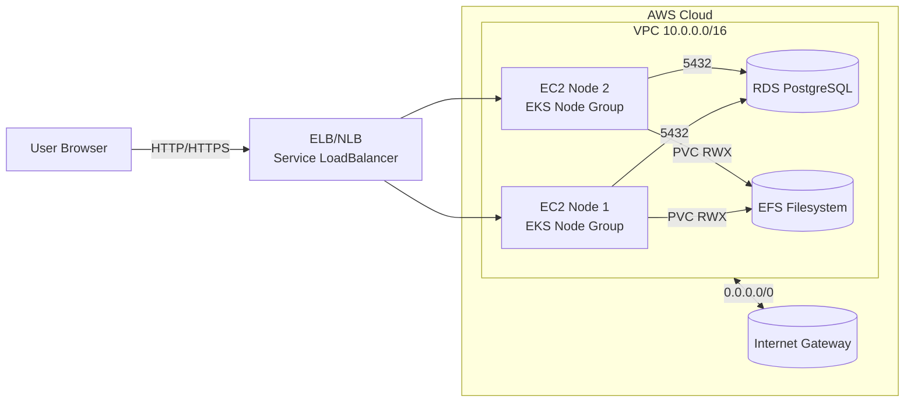
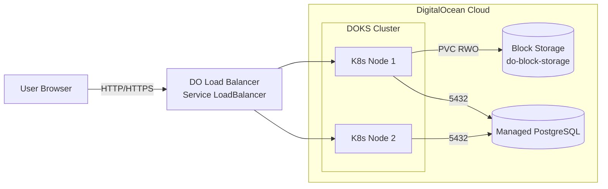

# Moodle IaC – So sánh kiến trúc AWS vs DigitalOcean (Kubernetes)

Repository này chứa hai cách triển khai Moodle trên Kubernetes:

- `aws/`: EKS + RDS + EFS trên AWS.
- `digitalocean/`: DOKS + Managed PostgreSQL + Block Storage trên DigitalOcean.

README tập trung vào:

- **Kiến trúc tổng quan** cho mỗi cloud.
- **Flow script** deploy/destroy.
- **Khác biệt quan trọng** khi chạy cùng một app trên hai cloud.

---

## 0. File `.env` – cấu hình & secrets (KHÔNG commit giá trị thật)

Tại thư mục `moodle-k8s-infra/` có file `.env` dùng chung cho cả AWS và DigitalOcean.  
File này **chỉ nên chứa cấu trúc & ví dụ**, mọi giá trị thật (password, token, domain thật) cần được chỉnh trên máy local và **không commit lên Git**.

Các nhóm biến chính:

- **Biến chung cho Moodle**
  - `MOODLE_WWWROOT` – URL site Moodle (ví dụ: `https://your-moodle-domain.example.com`).
  - `MOODLE_ADMIN_USER` – tài khoản admin.
  - `MOODLE_ADMIN_PASS` – mật khẩu admin (secret).
  - `MOODLE_ADMIN_EMAIL` – email admin.
  - `MOODLE_DB_USER` – user DB cho ứng dụng Moodle (ví dụ `moodleuser`).
  - `MOODLE_DB_PASS` – mật khẩu DB cho ứng dụng (secret).
- **AWS**
  - `AWS_PROFILE` – profile AWS CLI mà script sẽ dùng (mặc định: `devops`).
  - `AWS_REGION` – region AWS (ví dụ `ap-southeast-1`).
  - `AWS_ROLE_ARN` (optional) – ARN của IAM Role nếu bạn dùng assume role (ví dụ: `arn:aws:iam::123456789012:role/DevOpsRole`).
- **DigitalOcean**
  - `DO_TOKEN` – API token dùng cho Terraform/DO API (secret).
  - `DO_DB_ADMIN_PASSWORD` (tùy chọn) – mật khẩu cho user `doadmin` nếu không đọc được qua API (secret).

Ví dụ `.env` mẫu (chỉ là template, không dùng trực tiếp cho production):

```bash
# ==== Shared settings for both AWS and DigitalOcean ====
MOODLE_WWWROOT=https://your-moodle-domain.example.com
MOODLE_ADMIN_USER=admin
MOODLE_ADMIN_PASS=changeme_admin_password
MOODLE_ADMIN_EMAIL=admin@example.com
MOODLE_DB_USER=moodleuser
MOODLE_DB_PASS=changeme_db_password

# ==== AWS-specific settings ====
AWS_PROFILE=devops
AWS_REGION=ap-southeast-1
AWS_ROLE_ARN=arn:aws:iam::123456789012:role/DevOpsRole

# ==== DigitalOcean-specific settings ====
DO_TOKEN=changeme_digitalocean_api_token
# DO_DB_ADMIN_PASSWORD=changeme_do_db_admin_password
```

Khi deploy, các script (ví dụ `aws/setup.sh`) sẽ **load `.env` và inject biến** vào manifest K8s, vì vậy **không cần hard-code password/token trực tiếp trong file YAML/Terraform**.

## 1. Kiến trúc AWS (EKS + RDS + EFS)

### Thành phần chính

- **Networking**
  - `aws_vpc.moodle_vpc` – VPC riêng CIDR `10.0.0.0/16`.
  - 2 **Public Subnet**:
    - `10.0.1.0/24` (AZ `ap-southeast-1a`)
    - `10.0.2.0/24` (AZ `ap-southeast-1b`)
  - `aws_internet_gateway.igw` + `aws_route_table.public_rt` route `0.0.0.0/0` ra Internet.
  - Tag subnet cho EKS Load Balancer: `kubernetes.io/role/elb = 1`.
- **Kubernetes Cluster (EKS)**
  - `aws_eks_cluster.moodle_cluster` – control plane managed.
  - `aws_eks_node_group.moodle_nodes` – node group EC2:
    - Loại máy: `t3.micro`, autoscaling (min 1, desired 2, max 3).
  - IAM:
    - `aws_iam_role.eks_cluster_role` + policy `AmazonEKSClusterPolicy`.
    - `aws_iam_role.eks_node_role` + các policy cho:
      - EKS worker nodes.
      - CNI.
      - ECR read-only.
    - `aws_iam_role.efs_csi_role` + policy `AmazonEFSCSIDriverPolicy` (OIDC).
- **Database (RDS)**
  - `aws_db_instance.moodle_db` – PostgreSQL:
    - Engine: `postgres` 16.6, instance `db.t3.micro`, 20 GB gp2.
    - DB name `moodle`, user `moodleuser`, password hard-code trong Terraform.
  - `aws_db_subnet_group.moodle_db_subnet_group` – sử dụng 2 public subnet.
  - `aws_security_group.rds_sg` – mở cổng 5432 cho CIDR `10.0.0.0/16`.
  - Output: `rds_endpoint`.
- **Storage chia sẻ (EFS)**
  - `aws_efs_file_system.moodle_efs` – encrypted.
  - `aws_efs_mount_target.mt_1`, `mt_2` – mount vào 2 public subnet.
  - `aws_security_group.efs_sg` – mở cổng NFS 2049 cho `10.0.0.0/16`.
  - Output: `efs_id`.
- **Kubernetes Manifests (aws/k8s-moodle.yaml)**
  - `PersistentVolume` sử dụng CSI driver `efs.csi.aws.com`, `volumeHandle` = ID EFS.
  - `PersistentVolumeClaim` RWX (`ReadWriteMany`) gắn với EFS.
  - `Deployment` Moodle:
    - Image: `ndcuongdevops/moodle-lms:v1.0.6`.
    - Mount `/var/www/moodledata` từ PVC.
    - Env DB:
      - `MOODLE_DB_HOST` = endpoint RDS (hard-code).
      - `MOODLE_DB_USER`, `MOODLE_DB_PASSWORD` hard-code.
  - `Service` type `LoadBalancer` (ELB/NLB AWS).

### Sơ đồ kiến trúc AWS (mô tả)




Đặc trưng:

- Kiểm soát chi tiết VPC, subnet, route, security group.
- EKS sử dụng EC2 node group với IAM phức tạp.
- EFS cung cấp **ReadWriteMany** cho Moodle data, phù hợp nhiều replica.
- DB & mật khẩu đang hard-code trong IaC/K8s.

---

## 2. Kiến trúc DigitalOcean (DOKS + Managed DB + Block Storage)

### Thành phần chính

- **Provider & Region**
  - `digitalocean` provider với:
    - Biến `do_token` (API token – sensitive).
    - Biến `region` (mặc định `sgp1` – Singapore).
- **Kubernetes Cluster (DOKS)**
  - `digitalocean_kubernetes_cluster.moodle_cluster`:
    - Region: `sgp1`.
    - Version: `1.30.1-do.0` (có thể đổi theo version mới nhất).
    - `node_pool`:
      - name `moodle-node-pool`.
      - size `s-2vcpu-4gb`.
      - `node_count = 2`.
  - Output: `kubeconfig` (raw) để cấu hình `kubectl`/CI.
  - VPC & networking do DigitalOcean tự quản lý (không khai báo VPC/subnet/route thủ công).
- **Database (Managed Database)**
  - `digitalocean_database_cluster.moodle_db`:
    - Engine `pg`.
    - Version `16`.
    - Size `db-s-1vcpu-1gb`.
    - Node count 1.
  - `digitalocean_database_db.moodle` – DB `moodle`.
  - `digitalocean_database_user.moodle`:
    - Username `moodleuser`.
    - Password từ biến `db_password` (Terraform variable, sensitive).
  - Outputs:
    - `db_host` – private hostname.
    - `db_port`.
    - `db_name`.
    - `db_user`.
- **Storage cho Moodle (Block Storage qua CSI)**
  - Sử dụng **DigitalOcean Block Storage** thông qua CSI driver mặc định trên DOKS:
    - StorageClass: `do-block-storage`.
  - `PersistentVolumeClaim` `moodle-data-pvc`:
    - `accessModes: ReadWriteOnce`.
    - `storage: 50Gi`.
- **Kubernetes Manifests (digitalocean/k8s-moodle.yaml)**
  - `PVC` `moodle-data-pvc` dùng `do-block-storage`.
  - `Deployment` Moodle:
    - Image: `ndcuongdevops/moodle-lms:v1.0.6`.
    - Mount `/var/www/moodledata` từ PVC.
    - Env DB (placeholder):
      - `MOODLE_DB_HOST = "REPLACE_WITH_DO_DB_HOST"` (nên lấy từ output `db_host`).
      - `MOODLE_DB_PASSWORD = "REPLACE_WITH_DB_PASSWORD"` (nên đồng bộ với `db_password` và dùng Secret).
  - `Service` type `LoadBalancer` (DigitalOcean Load Balancer).

### Sơ đồ kiến trúc DigitalOcean (mô tả)




Đặc trưng (tóm tắt):

- Cluster Kubernetes managed (DOKS).
- Managed PostgreSQL + user app `moodleuser`.
- Storage dùng Block Storage (`do-block-storage`, RWO) cho `moodledata`.
- **Mật khẩu DB trên DigitalOcean**
  - `moodleuser`: DO tự sinh, script đọc từ Terraform output `db_password`.
  - `doadmin`: script cố gắng đọc qua DO API bằng `DO_TOKEN`, fallback là biến `DO_DB_ADMIN_PASSWORD`.
  - Xóa hạ tầng DO: chạy `digitalocean/do_destroy.sh`.

---

## 3. So sánh nhanh AWS vs DigitalOcean

- **Mạng & VPC**
  - **AWS**: tự định nghĩa VPC, subnet, route, security group → linh hoạt, chi tiết hơn nhưng phức tạp.
  - **DigitalOcean**: dùng VPC & networking managed của DOKS → đơn giản, ít Terraform hơn, đổi lại ít tùy biến mạng low-level.
- **Cluster Kubernetes**
  - **AWS (EKS)**: cần cấu hình IAM roles/policies, node group EC2, OIDC… → mạnh nhưng phức tạp.
  - **DigitalOcean (DOKS)**: chỉ cần khai báo cluster + node pool → dễ dùng hơn, ít khái niệm cloud-specific.
- **Database**
  - **AWS (RDS)**:
    - DB nằm trong VPC riêng, security group quyết định quyền truy cập.
    - Endpoint & password đang hard-code trong IaC/K8s.
  - **DigitalOcean (Managed DB)**:
    - Host & user/password được output từ Terraform, dễ tích hợp với secret hơn.
    - Mật khẩu đã tách ra thành Terraform variable (`db_password` – sensitive).
- **Storage cho Moodle data**
  - **AWS**:
    - Dùng **EFS** + CSI driver → `ReadWriteMany`, rất phù hợp multi-replica Moodle và chia sẻ file giữa node.
  - **DigitalOcean**:
    - Dùng **Block Storage** với StorageClass `do-block-storage` → `ReadWriteOnce`.
    - Đủ cho 1 replica hoặc workload ít yêu cầu share RWX; nếu cần giống EFS, phải bổ sung giải pháp khác (NFS server, 3rd-party RWX storage…).
- **Bảo mật thông tin nhạy cảm**
  - **AWS**: DB credentials đang xuất hiện trực tiếp trong Terraform & manifest.
  - **DigitalOcean**: mật khẩu DB đã được tách ra khỏi code (variable sensitive), nhưng manifest vẫn cần được refactor thêm để lấy từ K8s Secret.

---

## 4. Flow script AWS vs DigitalOcean

### 4.1. AWS – `aws/aws_full_setup.sh`


| Bước | Nội dung                                                                                                                                              |
| ---- | ----------------------------------------------------------------------------------------------------------------------------------------------------- |
| 0    | Kiểm tra công cụ (terraform, aws, kubectl, jq), kiểm tra AWS profile trong `.env`.                                                                    |
| 1    | **Terraform apply** trong `aws/`: tạo VPC, EKS, RDS, EFS; đọc output `efs_id`, `rds_endpoint` → `DB_HOST`.                                            |
| 2.1  | **Cấu hình kubectl cho EKS:** `aws eks update-kubeconfig --region ... --name moodle-cluster` (kubeconfig ghi vào `~/.kube/config`, dùng profile AWS). |
| 2.2  | **Cài EFS CSI addon** cho cluster: `aws eks create-addon ... aws-efs-csi-driver`.                                                                     |
| 2.3  | **Sửa manifest:** thay `volumeHandle` trong `k8s-moodle.yaml` bằng `EFS_ID` rồi `kubectl apply`.                                                      |
| 3    | Scale CoreDNS xuống 1 replica (tùy môi trường EKS).                                                                                                   |
| 4    | Chờ có pod Moodle → **tạo config.php** (host RDS, port để trống, không SSL bắt buộc) → `kubectl cp` vào pod.                                          |
| 5    | In thông tin Service (EXTERNAL-IP) để cập nhật DNS (Cloudflare).                                                                                      |
| 6    | Chown/chmod `moodledata` → chạy **install_database.php** (không bước grant DB đặc biệt).                                                              |


**Đặc điểm:** Kubeconfig gắn với AWS CLI profile; DB (RDS) trong VPC, app user có đủ quyền; storage EFS (RWX) gắn qua CSI sau khi có `efs_id`.

### 4.2. DigitalOcean – `digitalocean/do_full_setup.sh`


| Bước    | Nội dung                                                                                                                                                                                                                                        |
| ------- | ----------------------------------------------------------------------------------------------------------------------------------------------------------------------------------------------------------------------------------------------- |
| 0       | Kiểm tra công cụ (terraform, kubectl, jq), kiểm tra `DO_TOKEN` trong `.env`.                                                                                                                                                                    |
| 1       | **Terraform apply** trong `digitalocean/`: tạo DOKS, Managed PostgreSQL, DB + user; đọc output `db_host`, `db_port`, `db_password`, **kubeconfig (raw)**.                                                                                       |
| —       | Ghi kubeconfig ra file `digitalocean/kubeconfig-do`, **export KUBECONFIG** để mọi lệnh kubectl sau dùng cluster DO (không ghi đè `~/.kube/config`).                                                                                             |
| 2       | **Apply manifest:** thay placeholder `REPLACE_WITH_DO_DB_HOST` và `REPLACE_WITH_DB_PASSWORD` trong `k8s-moodle.yaml` rồi `kubectl apply` (không có bước cài addon storage; DOKS đã có CSI block storage).                                       |
| **2.5** | **Grant schema public cho user DB:** nếu có `DO_DB_ADMIN_PASSWORD`, chạy Job một lần (image postgres:15-alpine) kết nối với user **doadmin** và chạy `GRANT ALL/CREATE ON SCHEMA public TO moodleuser`; nếu không có thì in hướng dẫn và thoát. |
| 3       | Chờ pod Moodle Ready → **tạo config.php** (host/port từ Terraform, **dbport, sslmode=require, connect_timeout**) → `kubectl cp` vào pod.                                                                                                        |
| 4       | In thông tin Service (EXTERNAL-IP) để cập nhật DNS.                                                                                                                                                                                             |
| 5       | Chown/chmod `moodledata` → chạy **install_database.php** (có bật debug tạm, ghi log; nếu lỗi thì grep và in đoạn cuối); sau khi thành công xóa dòng debug trong config.                                                                         |


**Đặc điểm:** Kubeconfig lấy từ Terraform (raw), dùng file riêng; DB là Managed PostgreSQL nên bắt buộc bước **grant schema public** và config **SSL + port**; không có bước cài addon hay scale CoreDNS.

### 4.3. So sánh nhanh flow hai script


| Hạng mục            | AWS                                                    | DigitalOcean                                                                      |
| ------------------- | ------------------------------------------------------ | --------------------------------------------------------------------------------- |
| **Kubeconfig**      | `aws eks update-kubeconfig` → cập nhật default context | Terraform output raw → ghi file, `export KUBECONFIG=`                             |
| **Sau Terraform**   | Cài EFS CSI addon, sửa PV volumeHandle                 | Không addon; manifest chỉ thay host/password                                      |
| **Bước đặc thù**    | Scale CoreDNS (tùy cluster)                            | **Grant schema public** cho user DB (bắt buộc)                                    |
| **config.php**      | RDS: host, không bắt buộc port/SSL                     | Managed DB: **dbport**, **sslmode=require**, **connect_timeout**                  |
| **DB password**     | Lấy từ `.env` (MOODLE_DB_PASS) / Terraform             | `moodleuser` từ Terraform output, `doadmin` từ DO API hoặc `DO_DB_ADMIN_PASSWORD` |
| **Storage**         | EFS → CSI driver → volumeHandle thay mỗi lần apply     | Block Storage → StorageClass sẵn, không thay ID                                   |
| **Khi install lỗi** | In log trực tiếp                                       | Ghi log file, grep từ khóa lỗi + in 100 dòng cuối, bật debug tạm                  |


Sự khác biệt này phản ánh khác biệt kiến trúc (managed DB + SSL trên DO, RDS trong VPC trên AWS; EFS vs Block Storage) và giúp khi chuyển từ AWS sang DO hoặc ngược lại biết cần chỉnh script và config ở đâu.

Chi tiết lỗi do khác biệt môi trường (schema public, SSL, password, kubeconfig) xem thêm: [docs/AWS-TO-DO-MIGRATION-ISSUES.md](docs/AWS-TO-DO-MIGRATION-ISSUES.md).