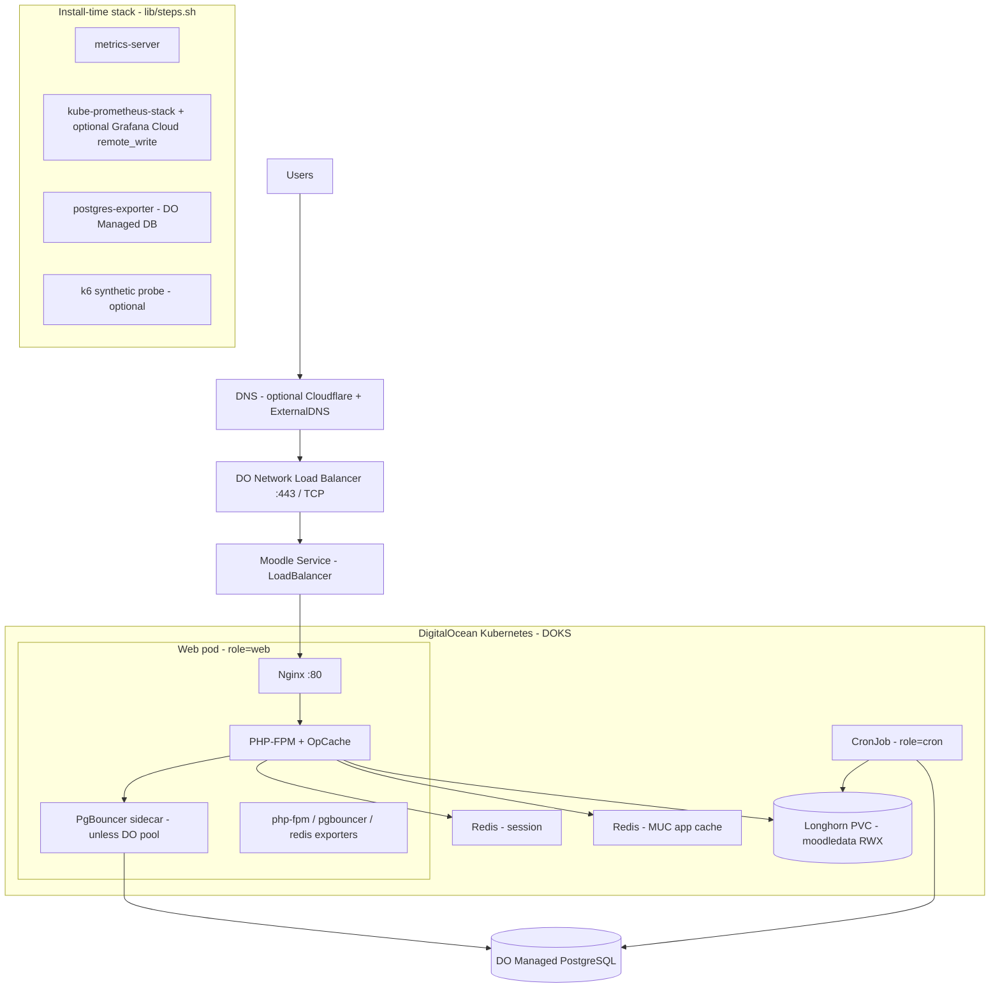

# Moodle on DigitalOcean Kubernetes

This repo deploys the [HCMUT Moodle image](https://github.com/nguyendangcuong201004/moodle-k8s-project) to **DOKS** (managed Kubernetes) with **Managed PostgreSQL**, in-cluster **Redis** (session + app cache), **Longhorn** storage, and a **Helm** release that `digitalocean/setup.sh` applies for you. No need to hand-tune the chart for a standard deploy.

Other folders (`aws/`, `azure/`) are optional paths; this document describes **only the DigitalOcean flow**.

## Architecture (current)



**What each layer does**

| Area | Technology |
|------|------------|
| Edge | DO Load Balancer in front of the Moodle `Service` (type `LoadBalancer` from setup). Optional **ExternalDNS** + **Cloudflare** for automatic DNS. |
| App | **Nginx** → **PHP-FPM** (Moodle), **OpCache** tuned in the image. Fixed replica count in chart (`replicaCount` / no HPA in current defaults). |
| DB | **Managed PostgreSQL** in the same region/VPC. App talks through **PgBouncer** in the pod, or a **DO connection pool** if you enable it in Terraform (`MOODLE_USE_MANAGED_POOL=true`). |
| Caching | Two **Redis** instances in the cluster: **session** store and **MUC** (application cache) for Moodle; wired via chart + post-install PHP in `setup.sh`. |
| Files | **Longhorn** `ReadWriteMany` PVC for `/var/www/moodledata`. |
| Background | **CronJob** runs Moodle scheduler (`role=cron`), separate from web pods (`role=web`). |
| Observability | **kube-prometheus-stack**, optional **Grafana Cloud** push; **postgres-exporter** for managed Postgres; PodMonitors for exporters. **Two** merged Grafana JSON dashboards under `grafana/dashboards/` (operations/SLO vs stack/cluster). |

### PostgreSQL: two-node cluster and read/write split

Terraform variable [`db_node_count`](digitalocean/variables.tf) defaults to **2** (primary + hot standby with streaming replication on DigitalOcean Managed Postgres). Use the same `db_size` for both nodes (symmetric tier, for example `db-s-2vcpu-4gb` or a larger plan if you need more RAM for `shared_buffers`).

For Moodle to send **SELECT** traffic to the standby while keeping writes on the primary, opt in explicitly:

- Set `MOODLE_ENABLE_READ_SPLIT=true` and `MOODLE_USE_MANAGED_POOL=false` in `.env` (see [`.env.example`](.env.example)). The managed DO connection pool and the current read-split wiring in [`lib/helpers.sh`](digitalocean/lib/helpers.sh) / [`lib/steps.sh`](digitalocean/lib/steps.sh) are mutually exclusive.
- After apply, `setup.sh` discovers the standby hostname from the DO API (`standby_connection.host`), passes it to Helm as `db.readonlyHosts[0]`, and enables a **second PgBouncer sidecar** on port **6433** so readonly queries are pooled to the replica (primary stays on **6432**).

Keep read split disabled for quiz/exam stress tests. Moodle creates an attempt and immediately reads it back; a lagging standby can return stale data and make a real submission flow fail even when the primary write succeeded.

**Observability:** scrape `pg_stat_replication` on the primary (e.g. from `psql` or any Postgres client) to inspect standby `replay_lag`. The web PodMonitor includes a second target **`pgb-ro-metrics`** (port 9128) when the read sidecar is active—use it with Grafana for pool wait vs the primary PgBouncer metrics. When a standby host is configured, `step_postgres_exporter` also deploys **`postgres-exporter-standby`** (ServiceMonitor on port 9188) so Prometheus can scrape replica-side stats (e.g. WAL receiver, connection load).

## Prerequisites

- Terraform ≥ 1.9, kubectl, Helm ≥ 3, jq, curl  
- DigitalOcean API token: `DO_TOKEN`  
- Repo-root `.env` (see below)

## Environment (`.env`)

Minimal variables for `./digitalocean/setup.sh`:

```bash
DO_TOKEN=dop_v1_...

MOODLE_ADMIN_USER=admin
MOODLE_ADMIN_PASS=...
MOODLE_ADMIN_EMAIL=admin@example.com

# Production site URL (HTTPS). Staging uses MOODLE_STAGING_WWWROOT when workspace=staging
MOODLE_WWWROOT=https://lms.example.com
MOODLE_STAGING_WWWROOT=https://staging-lms.example.com

# Optional: Cloudflare token for ExternalDNS
# CF_API_TOKEN=...

# Read replica (2-node DB): keep false for quiz/exam stress tests
MOODLE_ENABLE_READ_SPLIT=false
MOODLE_USE_MANAGED_POOL=false

# Optional: keep production settings unchanged, squeeze staging capacity.
# Useful when team droplet_limit is low but you need staging+production in parallel.
STAGING_ENABLE_NODE_AUTOSCALE=true
STAGING_NODE_POOL_SIZE=s-2vcpu-4gb
STAGING_NODE_POOL_COUNT=3
STAGING_NODE_POOL_MIN_NODES=3
STAGING_NODE_POOL_MAX_NODES=3
STAGING_MOODLE_REPLICA_COUNT=1
STAGING_MOODLEDATA_SIZE=20Gi
STAGING_LONGHORN_SC_REPLICA_COUNT=1
STAGING_LONGHORN_STORAGECLASS=longhorn-staging-r1
STAGING_MOODLE_CPU_REQUEST=500m
STAGING_MOODLE_MEMORY_REQUEST=1024Mi
STAGING_PGBOUNCER_CPU_REQUEST=120m
STAGING_PGBOUNCER_MEMORY_REQUEST=96Mi
```

## Commands (DigitalOcean)

```bash
cd digitalocean

# Create/update VPC resources + DOKS + Managed Postgres + deploy Moodle stack
./setup.sh staging      # or: ./setup.sh production

# Tear down Terraform-managed resources for that workspace
./destroy.sh staging    # or: ./destroy.sh production
```

After deploy, `setup.sh` prints the site URL and `export KUBECONFIG=.../kubeconfig-<workspace>`.

### Troubleshooting: `Kubernetes cluster unreachable` / `dial tcp ...:443: i/o timeout`

That message comes from **kubectl/helm** when your workstation cannot reach the **DOKS API server** (not a Moodle chart bug). Check:

- From the same shell: `export KUBECONFIG=.../digitalocean/kubeconfig-<workspace>` then `kubectl cluster-info` or `kubectl get ns`.
- Corporate VPN, proxy, or firewall blocking **outbound HTTPS** to the cluster endpoint.
- In the DigitalOcean control plane, **Kubernetes API** “trusted sources” / IP allowlist: your current public IP must be allowed if the feature is enabled.
- Retry after a few minutes; `setup.sh` also **retries `helm`** (`HELM_RETRIES`, `HELM_RETRY_DELAY_SEC` in [`digitalocean/config.sh`](digitalocean/config.sh)) to ride out short outages.
- A one-off log line like `memcache.go ... i/o timeout` during OpenAPI discovery can appear even when `kubectl cluster-info` succeeds; it is often transient. If it persists, set e.g. `export KUBECTL_CACHE_DIR="${TMPDIR:-/tmp}/kubectl-cache"` or upgrade `kubectl`.

## What `setup.sh` runs (order)

| Step | Action |
|------|--------|
| Terraform | DOKS cluster, Managed PostgreSQL, outputs for Helm |
| Longhorn | StorageClass + CSI for RWX volumes |
| metrics-server | Installed (cluster metrics; `kubectl top`) |
| Prometheus stack | kube-prometheus-stack (+ adapter optional); Grafana Cloud if configured in `.env` |
| Helm | `helm upgrade --install moodle` with DB/LB/pgbouncer values (you do not need to run Helm manually) |
| ExternalDNS | If `CF_API_TOKEN` is set |
| DB job | `GRANT` on `public` for the app user |
| Wait / install | Wait for web pod → moodledata permissions → `install_database.php` if fresh |
| Moodle CLI | Redis MUC mapping + lean site settings (`step_configure_moodle`) |
| postgres-exporter | Scrapes Managed Postgres |
| k6 probe manifest | Optional synthetic checks |

## Load testing (stress-test)

1. **Kube context**: same cluster as production/staging (`export KUBECONFIG=...`).  
2. **Seed data** (creates users, course, quiz; prints `COURSE_ID` / `QUIZ_CMID`):  

```bash
cd stress-test
./seed-auth-quiz-data.sh
# Optional overrides: USER_PREFIX=user USER_COUNT=100 COURSE_SHORTNAME=TOAN101 ...
```

3. Copy **`QUIZ_PATH`** / **`COURSE_PATH`** from the script output (or from Moodle URLs) into `stress-params.env`.  
4. Run:

```bash
./0_stress_testing.sh
```

Details: [stress-test/README.md](stress-test/README.md).

## Repo layout (short)

```
moodle-k8s-infra/
├── digitalocean/       # Terraform + setup.sh / destroy.sh — primary path
├── helm/moodle/        # Chart applied by setup.sh
├── stress-test/        # seed-auth-quiz-data.sh + k6
├── aws/, azure/        # Alternate clouds — not documented here
└── .github/workflows/  # validate.yml — Terraform + Helm checks
```

## CI

`.github/workflows/validate.yml` runs Terraform validate/plan (needs `DO_TOKEN` secret for plan) and Helm lint on push/PR.

## Cost note

DOKS, managed DB, and load balancers are billable. Use `destroy.sh` when tearing down demos to avoid ongoing charges.
