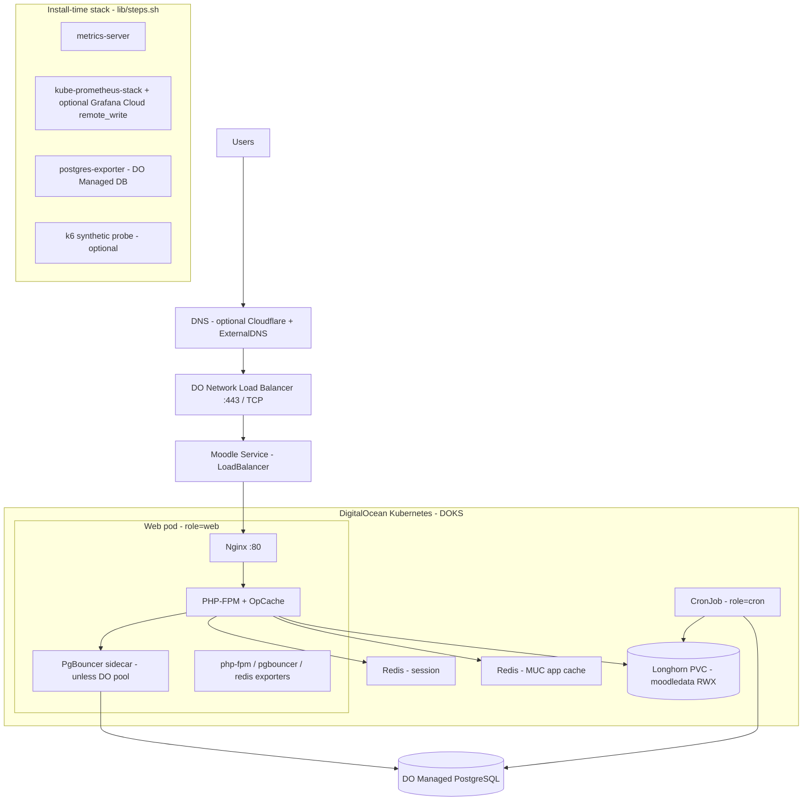

# Moodle on DigitalOcean Kubernetes

This repo deploys the [HCMUT Moodle image](https://github.com/nguyendangcuong201004/moodle-k8s-project) to **DOKS** (managed Kubernetes) with **Managed PostgreSQL**, in-cluster **Redis** (session + app cache), **Longhorn** storage, and a **Helm** release that `digitalocean/setup.sh` applies for you. No need to hand-tune the chart for a standard deploy.

Other folders (`aws/`, `azure/`) are optional paths; this document describes **only the DigitalOcean flow**.

## Architecture (current)



**What each layer does**

| Area | Technology |
|------|------------|
| Edge | DO Load Balancer in front of the Moodle `Service` (type `LoadBalancer` from setup). Optional **ExternalDNS** + **Cloudflare** for automatic DNS. |
| App | **Nginx** → **PHP-FPM** (Moodle), **OpCache** tuned in the image. Fixed replica count in chart (`replicaCount` / no HPA in current defaults). |
| DB | **Managed PostgreSQL** in the same region/VPC. App talks through **PgBouncer** in the pod, or a **DO connection pool** if you enable it in Terraform (`MOODLE_USE_MANAGED_POOL=true`). |
| Caching | Two **Redis** instances in the cluster: **session** store and **MUC** (application cache) for Moodle; wired via chart + post-install PHP in `setup.sh`. |
| Files | **Longhorn** `ReadWriteMany` PVC for `/var/www/moodledata`. |
| Background | **CronJob** runs Moodle scheduler (`role=cron`), separate from web pods (`role=web`). |
| Observability | **kube-prometheus-stack**, optional **Grafana Cloud** push; **postgres-exporter** for managed Postgres; PodMonitors for exporters. **Two** merged Grafana JSON dashboards under `grafana/dashboards/` (operations/SLO vs stack/cluster). |

## Prerequisites

- Terraform ≥ 1.9, kubectl, Helm ≥ 3, jq, curl  
- DigitalOcean API token: `DO_TOKEN`  
- Repo-root `.env` (see below)

## Environment (`.env`)

Minimal variables for `./digitalocean/setup.sh`:

```bash
DO_TOKEN=dop_v1_...

MOODLE_ADMIN_USER=admin
MOODLE_ADMIN_PASS=...
MOODLE_ADMIN_EMAIL=admin@example.com

# Production site URL (HTTPS). Staging uses MOODLE_STAGING_WWWROOT when workspace=staging
MOODLE_WWWROOT=https://lms.example.com
MOODLE_STAGING_WWWROOT=https://staging-lms.example.com

# Optional: Cloudflare token for ExternalDNS
# CF_API_TOKEN=...
```

## Commands (DigitalOcean)

```bash
cd digitalocean

# Create/update VPC resources + DOKS + Managed Postgres + deploy Moodle stack
./setup.sh staging      # or: ./setup.sh production

# Tear down Terraform-managed resources for that workspace
./destroy.sh staging    # or: ./destroy.sh production
```

After deploy, `setup.sh` prints the site URL and `export KUBECONFIG=.../kubeconfig-<workspace>`.

## What `setup.sh` runs (order)

| Step | Action |
|------|--------|
| Terraform | DOKS cluster, Managed PostgreSQL, outputs for Helm |
| Longhorn | StorageClass + CSI for RWX volumes |
| metrics-server | Installed (cluster metrics; `kubectl top`) |
| Prometheus stack | kube-prometheus-stack (+ adapter optional); Grafana Cloud if configured in `.env` |
| Helm | `helm upgrade --install moodle` with DB/LB/pgbouncer values (you do not need to run Helm manually) |
| ExternalDNS | If `CF_API_TOKEN` is set |
| DB job | `GRANT` on `public` for the app user |
| Wait / install | Wait for web pod → moodledata permissions → `install_database.php` if fresh |
| Moodle CLI | Redis MUC mapping + lean site settings (`step_configure_moodle`) |
| postgres-exporter | Scrapes Managed Postgres |
| k6 probe manifest | Optional synthetic checks |

## Load testing (stress-test)

1. **Kube context**: same cluster as production/staging (`export KUBECONFIG=...`).  
2. **Seed data** (creates users, course, quiz; prints `COURSE_ID` / `QUIZ_CMID`):  

```bash
cd stress-test
./seed-auth-quiz-data.sh
# Optional overrides: USER_PREFIX=user USER_COUNT=100 COURSE_SHORTNAME=TOAN101 ...
```

3. Copy **`QUIZ_PATH`** / **`COURSE_PATH`** from the script output (or from Moodle URLs) into `stress-params.env`.  
4. Run:

```bash
./run-stress-test.sh
```

Details: [stress-test/README.md](stress-test/README.md).

## Repo layout (short)

```
moodle-k8s-infra/
├── digitalocean/       # Terraform + setup.sh / destroy.sh — primary path
├── helm/moodle/        # Chart applied by setup.sh
├── stress-test/        # seed-auth-quiz-data.sh + k6
├── aws/, azure/        # Alternate clouds — not documented here
└── .github/workflows/  # validate.yml — Terraform + Helm checks
```

## CI

`.github/workflows/validate.yml` runs Terraform validate/plan (needs `DO_TOKEN` secret for plan) and Helm lint on push/PR.

## Cost note

DOKS, managed DB, and load balancers are billable. Use `destroy.sh` when tearing down demos to avoid ongoing charges.
